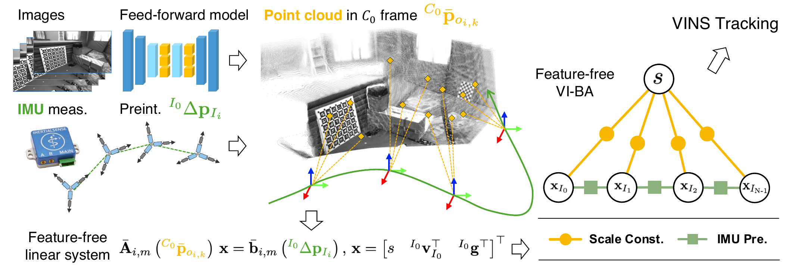

<p align="center">
  <h1 align="center"><strong>Efficient Feature-Free Initialization for Monocular Visual-Inertial Systems Using a Feed-Forward 3D Model</strong></h1>
  <p align="center">
    <a href="https://scholar.google.com/citations?user=Lh2CthAAAAAJ&hl">Yuantai Zhang</a><sup>1</sup>,
    <a href="https://scholar.google.com/citations?hl=zh-CN&user=f7ox7CIAAAAJ">Jiaqi Yang</a><sup>1</sup>,
    <a href="https://huajian-zeng.github.io/">Huajian Zeng</a><sup>1</sup>,
    <a href="https://changhao-chen.github.io/">Changhao Chen</a><sup>2</sup>,
    <a href="https://sites.google.com/view/haoangli/homepage">Haoang Li</a><sup>2</sup>,
    <a href="https://scholar.google.com/citations?user=6JscxDkAAAAJ&hl=zh-CN">Liang Li</a><sup>3</sup>,
    <a href="https://mbzuai.ac.ae/study/faculty/dezhen-song/">Dezhen Song</a><sup>1</sup>,
    <a href="https://xingxingzuo.github.io/">Xingxing Zuo</a><sup>1,*</sup>
    <br>
    <sup>1</sup>MBZUAI, <sup>2</sup>HKUST (GZ), <sup>3</sup>ZJU
    <br>
    <sup>*</sup>Corresponding author
    <br>
  </p>

  <p align="center">🎉 <strong>Accepted to RSS 2026</strong> </p>
</p>

<div id="top" align="center">

[](https://arxiv.org/abs/2605.17327)
[](https://www.gnu.org/licenses/gpl-3.0)
[](https://github.com/rpng/open_vins)

</div>


## Abstract

Fast and reliable initialization is critical for monocular visual-inertial navigation
systems (VINS), as it establishes the starting conditions for subsequent state estimation.
Despite steady progress, most existing methods heavily rely on visual feature correspondences
and require 3–4 seconds of sensory data for successful initialization, which limits their
applicability and efficiency. With the advent of feed-forward 3D models that can directly
predict point clouds from images, we revisit the visual-inertial initialization problem from
a concise perspective. In this work, we propose a feature-free initialization framework that
leverages up-to-scale point clouds predicted by a feed-forward 3D model, thereby obviating
the need for visual feature tracking and estimation. This design substantially reduces system
complexity and improves the reliability of initialization. Experiments on public datasets
demonstrate that the proposed feature-free initialization method achieves the highest success
rate, exceeding 90%, and significantly reduces the data duration required for successful
initialization, typically to under 1.2 s. We further validate our method on a self-collected
dataset covering various indoor and outdoor scenarios, demonstrating robust performance,
particularly in visually degraded environments where existing methods often fail.



## Supplementary Video

<!-- TODO: replace with YouTube link, e.g.
[](https://youtu.be/VIDEO_ID)
-->

> 🎬 Supplementary video coming soon — a YouTube link will be added here.

## Repository Status

> The full source release is in preparation and will be pushed here shortly. 
## Citation

```bibtex
@inproceedings{zhang2026ffvioinit,
  title     = {Efficient Feature-Free Initialization for Monocular Visual-Inertial
               Systems Using a Feed-Forward 3D Model},
  author    = {Zhang, Yuantai and Yang, Jiaqi and Zeng, Huajian and Chen, Changhao
               and Li, Haoang and Li, Liang and Song, Dezhen and Zuo, Xingxing},
  booktitle = {Proceedings of Robotics: Science and Systems (RSS)},
  year      = {2026}
}
```
## Acknowledgements

This work is built on top of [OpenVINS](https://github.com/rpng/open_vins) and uses the [VGGT](https://github.com/facebookresearch/vggt) and [Pi3](https://github.com/yyfz/Pi3)
feed-forward 3D models. We thank all teams for their open-source releases.